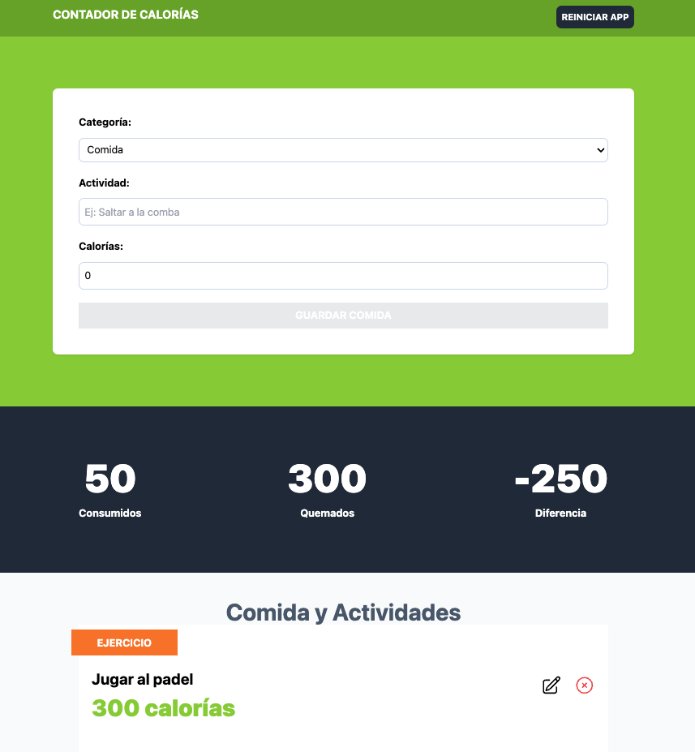

# CalorieTracker - React & useReducer

## Descripción
Este proyecto es una aplicación de control de calorías tanto para el deporte como para la alimentación diaria, desarrollada con **React**. Durante su desarrollo, he aprendido a manejar formularios con validaciones, gestionar entradas de usuario, enviar y reiniciar datos, y deshabilitar el botón de envío cuando es necesario. Además, he trabajado con **useReducer** para gestionar el estado de la aplicación de manera eficiente.

## Tecnologías utilizadas
- **React**: Biblioteca principal para la construcción de la interfaz.
- **useReducer**: Para manejar la lógica del estado de forma estructurada.
- **uuidv4**: Para la generación de identificadores únicos en las actividades y comidas.
- **Heroicons**: Para añadir iconos y mejorar la interfaz de usuario.
- **Vite**: Para la configuración y optimización del entorno de desarrollo.

## Lecciones aprendidas
1. **Gestión de formularios en React**:
   - Validaciones de entrada para asegurar datos correctos.
   - Reinicio de datos tras la entrada del usuario.
   - Deshabilitación del botón de envío según la validación del formulario.
   
2. **Gestión de estado con useReducer**:
   - Permite una lógica más clara y modular en el manejo de acciones.
   - Facilita la actualización de datos sin depender de múltiples estados individuales.
   
3. **Uso de bibliotecas externas**:
   - **uuidv4** para asignar identificadores únicos a cada entrada de calorías.
   - **Heroicons** para proporcionar una interfaz visualmente atractiva.

## Deploy
Puedes ver la aplicación funcionando en el siguiente enlace:  
🔗 [CalorieTracker Deploy](https://juli-control-calorias.netlify.app)

